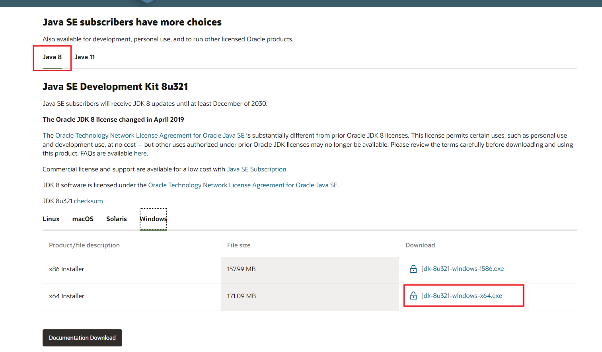
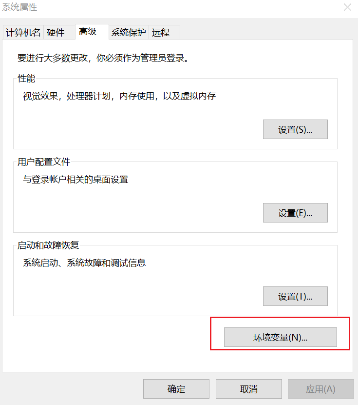
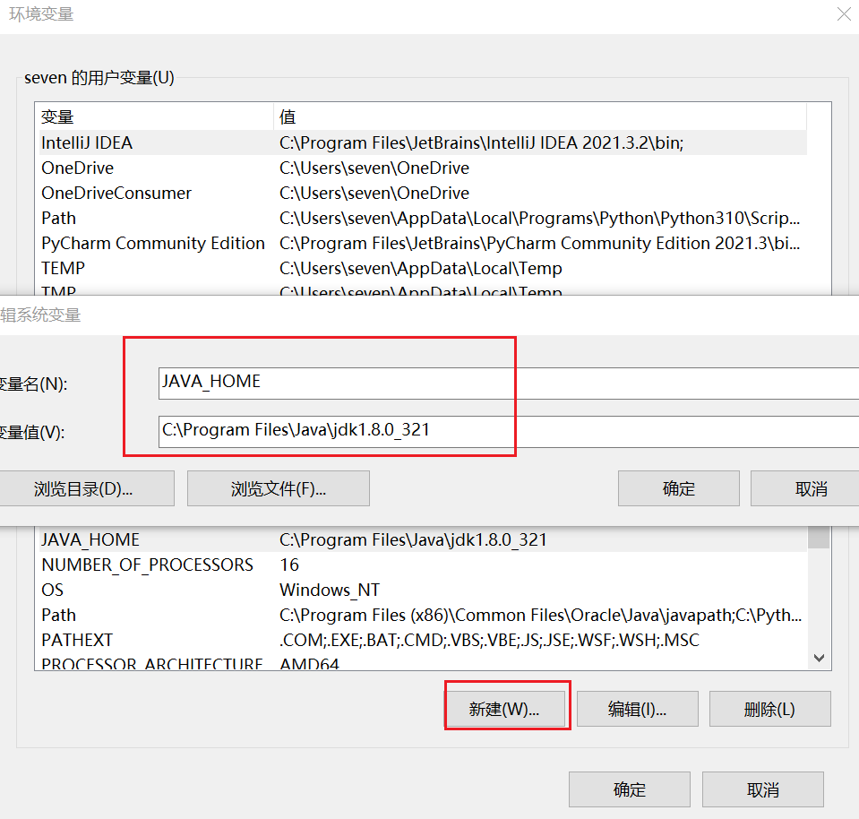
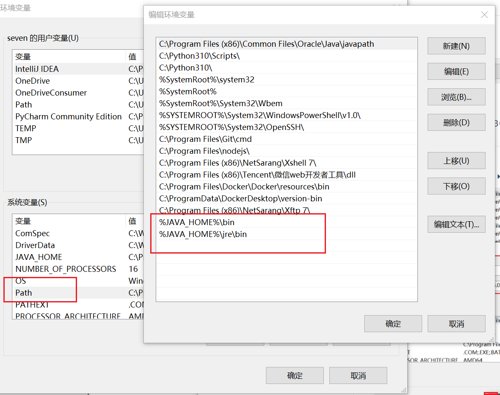
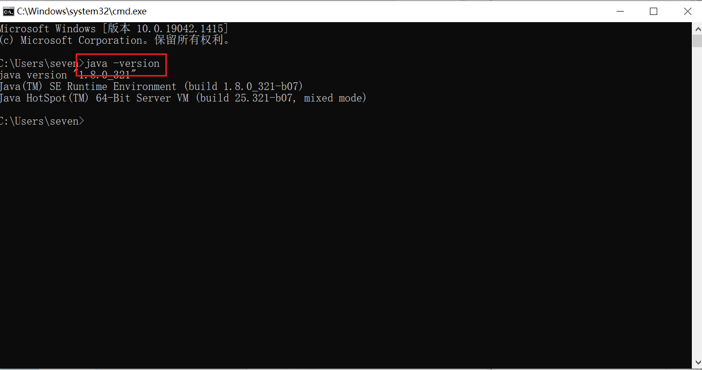
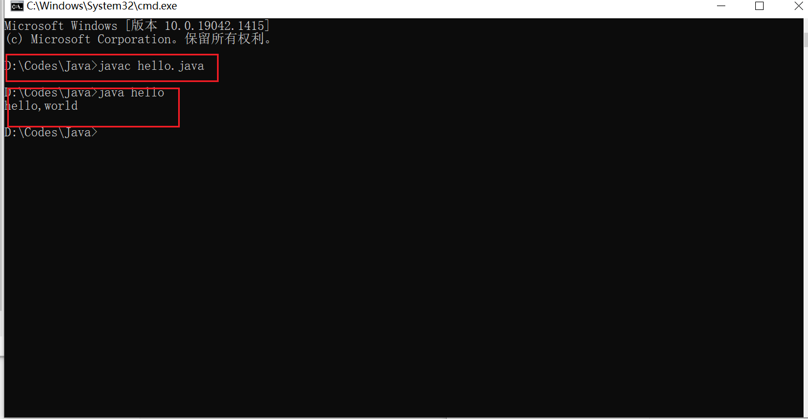

### 卸载JDK

1. 删除java的安装目录
2. 删除JAVA_HOME
3. 删除path下关于java的目录
4. java -version

### 安装JDK

1. 下载地址：https://www.oracle.com/java/technologies/downloads/#java8-windows

  

 2.双击安装jdk

3、配置环境变量



- 增加JAVA_HOME



- path 中新建jdk、jre路径



- 命令行下测试 



### Hello World

1. 新建文件hello.java

2. 书写代码

   ```java
   public class hello {
       public static void main(String[] args) {
           System.out.println("hello,world");
       }
   }
   ```

   

3. 编译文件hello.java、运行

   